# Atelier : coordonnées polaires avec les épicycloïdes

## Systèmes de coordonnées

Vous êtes  familier du système de coordonnées cartésien, où la position d’un point *P* sur le plan est donnée par les distances *x* et *y* sur chacun des axes (abscisses et ordonnées) à l’origine *O* :

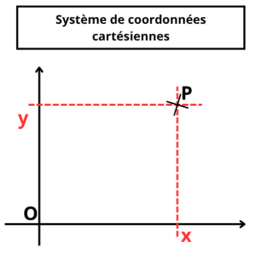

Il existe un autre moyen d’indiquer la position de *P*, à l’aide d’un système de coordonnées polaires, grâce, cette fois, à une unique distance *(r =OP)* et un angle, *φ*, que fait le segment *OP* avec l’axe des abscisses :

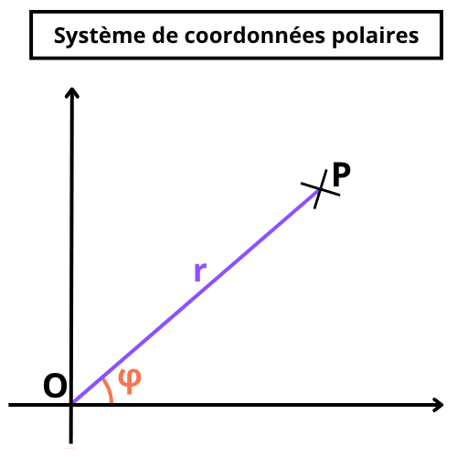

Ce système est intéressant lorsqu’il est plus direct d’indiquer la position relative de deux objets à l’aide d’angles (rotation, mouvement pendulaire, etc.), car dans un repère cartésien cela demanderait de faire intervenir des formules trigonométriques, moins lisibles.

Bien sûr dans un programme nous affichons les objets à l’écran selon un système cartésien (distance en matière de largeur et de longueur de fenêtre), mais nous pouvons très bien utiliser des calculs simples dans un système polaire, puis convertir la position finale de l‘objet que nous voulons afficher dans le système cartésien. Les formules sont obtenues immédiatement de la définition des sinus et cosinus :

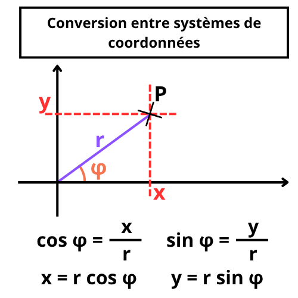

En effet, par définition, le cosinus de l’angle *φ* est égal au rapport entre *x* et *r* :

$$
\cos(\varphi) = \frac{x}{r} 
$$

$$
x = r . \cos(\varphi)
$$

Et de même pour le sinus de *φ* :

$$
\sin(\varphi) = \frac{y}{r}
$$

$$
y = r . \sin(\varphi)
$$

Pour obtenir les coordonnées polaires *(r, φ)* à partir des coordonnées cartésiennes *(x, y)*, on peut obtenir *r* par application directe du théorème de Pythagore, et *φ* grâce à la fonction arctangente :

$$
r = \sqrt{x^2+y^2}
$$

$$
\varphi = \arctan2(y, x)
$$

Pour un rappel de la fonction *arctan2()* vous pouvez consulter [l’annexe de cet autre atelier](https://github.com/aucoindujeu/codeclub/tree/main/pygame/boids#trouver-le-bon-angle)

## Application : courbes dans le plan et épicycloïdes

Vous êtes certainement familier avec le tracer de courbes définies par des valeurs prises par *x* et *y*, où en général on exprime la valeur de *y* en fonction de celle de *x* (la plus simple étant l’équation de droite : *y = ax + b* ), *x* allant de *-∞* à *+∞*. 

On peut également définir des courbes par les valeurs que peuvent prendre *r* et *φ* dans un système de coordonnées polaires, où on va exprimer la valeur de *r* en fonction de celle de *φ*, ce dernier prenant des valeurs entre 0° et 360° (ou 0 et 2π radians). De par la nature cyclique des valeurs d’angles, on pourra facilement définir des courbes qui bouclent sur elles-mêmes.

Prenons pour exemple les courbes épicycloïdes. Derrière ce nom barbare se cache une famille de figures qui décrivent une trajectoire bien particulière : imaginez une roue (un cercle ou un disque) qui tourne sur un autre roue (cercle) sur laquelle elle prend appui sans glisser, comme le montre la figure ci-dessous :

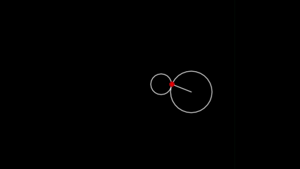

Nous avons tracé un rayon et un point rouge pour bien montrer le mouvement. Dans notre exemple, nous avons fait tourner la roue dans le sens anti-trigonomètrique (sens horaire), ce n’est pas bien important, mais la simplicité voudrait que l’on respecte le sens trigonométrique (ce que l’on fera dans les calculs ci-dessous). Dans tous les cas, la trajectoire du point rouge va correspondre à un tracé caractéristique qui va dépendre de la taille relative des deux roues (de leur rayons respectifs), et qui sera de la famille des épicycloïdes.

Si les deux roues ont exactement le même rayon, elle vont tracer une épicycloïde en forme de cœur que l’on va appeler *cardioïde* :

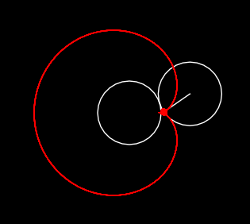

Si le rayon de la roue extérieure est deux fois plus petit que celui de la roue centrale, l’épicycloïde dessinée sera alors une *néphroïde* (car la courbe a alors la forme d’un rein) :

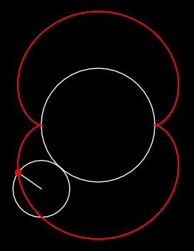

Si le rayon de la roue extérieure est trois fois plus petit, l’épicycloïde prendra la forme suivante, à trois lobes : 

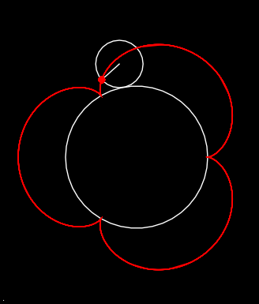

Bien sûr, les rapports entre les rayons ne sont pas obligatoirement entiers, par exemple pour un rapport de 3/2 nous obtenons la figure suivante :

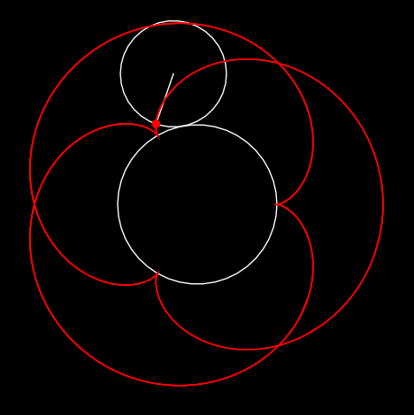 

Le cercle intérieur peut avoir également un rayon inférieur à celui du cercle extérieur, dans ce cas la figure résultante sera (rapport 1/2) :

Il n‘y a pas de limite au nombre de figures que l’ont peu obtenir (rapport 25/80) :

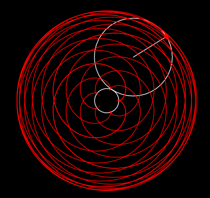

Ces courbes ont des applications dans des domaines très différents, mécanique bien sûr (pour prévoir la trajectoire de systèmes d’engrenages ou de bras articulés par exemples), mais en optique aussi par exemple, car l’enveloppe des rayons lumineux subissant une réflexion sur une surface ou une courbe (par exemple réfléchis par le bord intérieur d’une tasse, ou le fond d’une louche bien ronde), pourra prendre la forme d’une cardioïde ou d’une néphroïde. Voir à ce sujet [cet article traitant de ce phénomène sur Wikipédia](https://fr.wikipedia.org/wiki/Caustique). Il s’agit par exemple d’un phénomène difficile à reproduire avec des méthodes comme le ray tracing, mais facile à modéliser en optique géométrique.

Ces courbes ont été étudiées par tous les grands noms des mathématiques et de la physique : Bernouilli, Huygens, Leibnitz, Euler, Halley, Newton… Aristote et Ptolémée les utilisèrent pour modéliser le mouvement des planètes (en considérant qu’elles tournaient autour de la Terre).

L’objectif de cet atelier est de créer un petit programme qui permet de générer des épicycloïdes en utilisant ce que nous avons vu sur les coordonnées polaires et leur transformation en coordonnées cartésiennes pour les afficher sur l’écran. Voici une démo (réalisée avec Lua/Löve 2D, mais vous pouvez bien sûr réaliser le même programme en Python/PyGame, ou tout autre langage).

## Les formules

Voyons d’un peu plus près quelles équations nous permettraient de définir cette famille de courbes.

Faisons un schéma du dispositif (roue qui tourne sur une autre roue, sans glisser), en annotant les distances et les angles utiles :

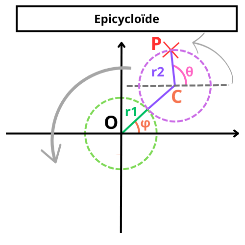

Nous cherchons une formule pour exprimer OP en fonction de *r1, r2, φ* et *θ*.

Déjà nous pouvons immédiatement poser que :

$$
\overrightarrow{OP} = \overrightarrow{OC} + \overrightarrow{CP}
$$

On a tout aussi rapidement :

$$
\overrightarrow{CP} = \begin{bmatrix}
    x(\theta) = r_2 \cos \theta \\
    y(\theta) = r_2 \sin \theta
  \end{bmatrix}
$$

$$
\overrightarrow{OC} = \begin{bmatrix}
	x(\varphi) = (r_1+r_2) \cos \varphi \\
	y(\varphi) = (r_1+r_2) \sin \varphi
\end{bmatrix}
$$

Il nous faudrait pouvoir exprimer *θ* en fonction de *φ*. Déjà on peut observer qu’au point de départ (choisi arbitrairement, certes, mais qui nous permet de comprendre la situation), alors que *φ* = 0, *θ = π* :

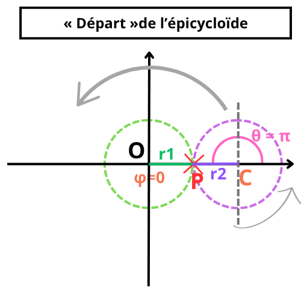

En fait, le point *P* qui nous intéresse au départ est situé à droite de la roue centrale, mais à gauche de la roue extérieure qui se meut : il y a bien un décalage de *π* radians (ou 180°) entre les angles *θ* et *φ*, qui sera constant tout au cours du déplacement.

Et voilà la situation lors du déplacement de la roue (ici dans un cas un peu différent, où la roue extérieure est un peu plus petite que la roue centrale) :

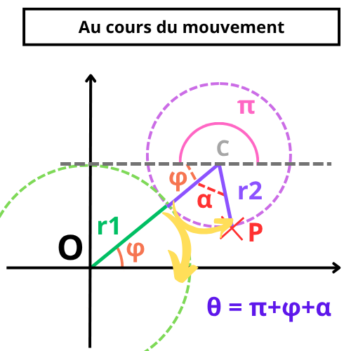

Nous voyons que lors du déplacement, nous pouvons décomposer *θ* en trois composante : le décalage π que nous venons de constater, auquel s’ajoute un angle que l’on peut géométriquement décomposer comme étant égal à φ plus une composante α.

Il faut bien comprendre que quand la roue extérieure parcours une longueur *l* sur le périmètre de la roue centrale, elle parcours un arc de cercle dont la longueur *l* est égale à *r1 . φ*  (longueur d’un arc de cercle sur un cercle de rayon *r1* et selon un angle *φ*). De manière symétrique, la même distance sera parcourue sur le périmètre de la roue extérieure, mais cela ne correspondra pas au même arc de cercle ! Si les roues n’ont pas le même rayon, il va y avoir un décalage : si la roue extérieure est la plus grande, elle va tourner d’un angle inférieur à celui correspondant à l’arc parcouru sur la roue centrale pour la même distance, et réciproquement si elle est plus petite.  Il faut donc déterminer l’angle qui va correspondre à « l’avance » ou au « retard » des angles de rotations respectifs des roues de taille différentes. Dans le cas de roues de même taille, on sait que les angles seront identiques (*α = φ*).

On voit sur le schéma que cette distante équivalente parcouru sur le cercle extérieur sera l’arc de cercle correspondant à un angle *α*, que nous devons déterminer.

Posons déjà les contraintes. Si *lr1* est l’arc de cercle parcouru sur la roue de rayon *r1* et *lr2* l’arc parcouru sur la roue extérieure, ces arcs de cercle sont définis ainsi :

$$
l_{r_1} = r_1 . \varphi
$$

$$
l_{r_2} = r_2. \alpha
$$

Ces longueurs doivent être identiques (roulement sans glissement) :

$$
l_{r_2} = l_{r_1}
$$

$$
r_2 . \alpha = r_1 . \varphi
$$

$$
\alpha = \frac{r_1}{r_2} \varphi
$$

D’où :

$$
\theta = \pi + \frac{r_1}{r_2} \varphi + \varphi
$$

$$
\theta = \pi + (1 + \frac{r_1}{r_2}) \varphi
$$

$$
\theta = \pi + \frac{r_1 + r_2}{r_2} \varphi
$$

On voit bien que si les roues ont le même rayon, alors on retrouve bien *α = φ*, si la roue extérieure est plus grand alors *α < φ* et si elle est plus petite *α > φ*.

On peut donc réécrire nos formules :

$$
\overrightarrow{OP} = \overrightarrow{OC} + \overrightarrow{CP}
$$

$$
\overrightarrow{OP} = \begin{bmatrix}
    x(\theta) = r_2 \cos θ \\
    y(\theta) = r_2 \sin θ
  \end{bmatrix} +
  \begin{bmatrix}
  	x(\varphi) = (r_1+r_2) \cos φ \\
	y(\varphi) = (r_1+r_2) \sin φ
  \end{bmatrix}
$$

$$
\overrightarrow{OP} = \begin{bmatrix} 
x(\varphi) = r_2 \cos(\pi + \frac{r_1 + r_2}{r_2} \varphi) + (r_1 + r_2) \cos \varphi \\
y(\varphi) r_2 \sin(\pi + \frac{r_1 + r_2}{r_2} \varphi) + (r_1 + r_2) \sin \varphi
\end{bmatrix}
$$

$$
\overrightarrow{OP} = \begin{bmatrix} 
x(\varphi) = (r_1 + r_2) \cos \varphi - r_2 \cos(\frac{r_1 + r_2}{r_2} \varphi) \\
y(\varphi) = (r_1 + r_2) \sin \varphi - r_2 \sin(\frac{r_1 + r_2}{r_2} \varphi)
\end{bmatrix}
$$
 

## Le programme

Maintenant que nous avons des équations qui nous permettent de tracer des épicycloïdes à l’écran, écrire le programme est un jeu d’enfant. C’est un bon exercice pour réviser ou prendre en main des framework de créations de jeux, comme Pygame, Pyxel ou Löve2D. Je vais seulement détailler les étapes à suivre, si vous bloquez vous pouvez toujours jeter un œil [sur l’exemple de code que je propose](./src/main.lua) (en Lua/Löve2D), que vous adapterez dans le langage et le framework que vous aurez choisi (c’est un très bon exercice).

### Spécification

Je vous propose de créer un programme selon les spécifications suivantes :

1. Afficher un cercle central et un cercle extérieur
2. Afin de mettre en évidence le roulement du cercle extérieur, afficher un rayon de ce cercle ainsi qu’afficher en couleur (j’ai choisi le rouge) le point situé sur le cercle extérieur dont on va suivre la trajectoire (cf. captures d’écran ci-dessus)
3. Animer
4. Au fur et à mesure que le cercle / point se déplace, faire apparaître la trajectoire du point d’intérêt, qui tracera une épicycloïde
5. On peut afficher quelques informations : les longueurs des rayons, du rapport entre les longueurs
6. Pour ajouter un peu d’interactivité, on peut prévoir les contrôles suivants :
   * une touche pour activer/désactiver le tracé de l’épicycloïde
   * des touches différentes pour modifier (augmenter/réduire) les rayons des cercles afin de pouvoir observer comment le rapport entre ces rayons affecte la forme de l’épicycloïde (dans ce cas prévoir une remise à zéro du tracé de l’épicycloïde)
   * une touche pour afficher / cacher les instructions
   * une touche pour quitter
   * d’autres possibilités : modifier la vitesse d’évolution, la couleur, etc.

### Étapes 

1. Prévoir et déclarer les constantes et variables nécessaires : 
   * taille de la fenêtre, 
   * 2 rayons pour les deux cercles, 
   * éventuellement une variable pour stocker la somme des deux rayons (on va l’utiliser souvent)
   * l’angle phi - ou theta selon comment vous voulez l’appeler -, 
   * les coordonnées des centres des cercles, 
   * les coordonnées du point à suivre
   * une table ou une liste pour stocker les coordonnées des points de l’épicycloïde
   * toute autre variable pour stocker l’état du jeu (afficher/cacher les instructions, afficher/cacher l’épicycloïde, de combien les rayons augmentent/diminues quand on appuie sur les touches (le pas), la vitesse du roulement, etc.)
2. Je ne l’ai pas fait dans mon exemple, mais ce serait une bonne pratique de prévoir une fonction pour calculer les coordonnées cartésiennes à partir des coordonnées polaires
3. Update : 
   * on incrémente la valeur de l’angle (la valeur fixera la vitesse de roulement du cercle)
   * on calcule la nouvelle position du cercle extérieur à partir de la nouvelle valeur de l’angle
   * on ajoute à la liste la position nouvellement calculé du point dont on suit la trajectoire à partir de la nouvelle valeur de l’angle
4. On gère les contrôles (à voir le moment/ l’endroit en fonction du framework) et on met à jour les variables associées
5. Affichage :
   * on affiche les cercles
   * on affiche la trajectoire à partir des coordonnées dans la liste si l’affichage est activé
   * on affiche les instructions si l’affichage est activé
   * on affiche les informations (longueurs des rayons, etc.)

Et c’est tout ! Bon travail.

## Pour aller plus loin

On peut enrichir notre programme de différentes manières :

- ajouter des contrôles pour proposer plus d’options (modifier le pas de la modification de la longueur des rayons)
- une épicycloïde est la trajectoire d’un point à la périphérie d’une roue qui roule sur le bord *extérieur* d’un cercle. Une *hypocycloïde* est la courbe qui correspond à la trajectoire d’une roue qui roule du côté *intérieur* d’un cercle. Saurez-vous ajouter une commande à notre programme (en appuyant sur `'m'` comme « mode » par exemple ) pour passer à la création d’une hypocycloïde. 
- Nous avons dessiné la trajectoire d’un point situé à le bord d’une roue qui se déplace. Mais on pourrait très bien dessiner la trajectoire d’un point situé à un endroit quelconque à *l’intérieur* de cette même roue, ou, à « *l’extérieur* » (même si cette dernière formulation est un peu étrange). Les courbes obtenues seront alors des *épitrochoïdes* (ou des *hypotrochoïdes* dans le cas où la roue roule sur le bord intérieur du rond central). C’est le principe exploité par les spirographes, auxquels vous avez certainement déjà joué plus jeune. Implémentez cette possibilité.
- un problème de notre programme est qu’il ne cesse d’ajouter des éléments à la table `epi` (qui stocke les points de la courbe). Au bout d’un certain temps cela peut poser des problèmes de performance voire dépasser la capacité de la mémoire. Sachant que ces fonctions sont cycliques, comment pourrait-on faire pour repérer que l’on a fait un tour et qu’il est inutile de stocker de nouveaux points ?
- Un site qui présente de nombreuses courbes dans le plan que l’on peut tracer à l’aide de formules exprimées en coordonnées polaires : https://www.mathcurve.com/courbes2d/courbes2d.shtml

