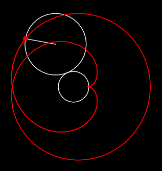

# Atelier : coordonnées polaires avec les épicycloïdes

## Systèmes de coordonnées

Vous êtes  familier du système de coordonnées cartésien, où la position d’un point *P* sur le plan est donnée par les distances *x* et *y* sur chacun des axes (abscisses et ordonnées) à l’origine *O* :

Il existe un autre moyen d’indiquer la position de *P*, à l’aide d’un système de coordonnées polaires, grâce, cette fois, à une unique distance *(r =OP)* et un angle, *φ*, que fait le segment *OP* avec l’axe des abscisses :

Ce système est intéressant lorsqu’il est plus direct d’indiquer la position relative de deux objets à l’aide d’angles (rotation, mouvement pendulaire, etc.), car dans un repère cartésien cela demanderait de faire intervenir des formules trigonométriques, moins lisibles.

Bien sûr dans un programme nous affichons les objets à l’écran selon un système cartésien (distance en matière de largeur et de longueur de fenêtre), mais nous pouvons très bien utiliser des calculs simples dans un système polaire, puis convertir la position finale de l‘objet que nous voulons afficher dans le système cartésien. Les formules sont obtenues immédiatement de la définition des sinus et cosinus :

En effet, par définition, le cosinus de l’angle *φ* est égal au rapport entre *x* et *r* :
$$
\cos(\varphi) = \frac{x}{r} \\
x = r \cos(\varphi)
$$
Et de même pour le sinus de *φ* :
$$
\sin(\varphi) = \frac{y}{r} \\
y = r \sin(\varphi)
$$
Pour obtenir les coordonnées polaires *(r, φ)* à partir des coordonnées cartésiennes *(x, y)*, on peut obtenir *r* par application directe du théorème de Pythagore, et *φ* grâce à la fonction arctangente :
$$
r = \sqrt{x^2+y^2} \\
\varphi = \arctan2(y, x)
$$
Pour un rappel de la fonction *arctan2()* vous pouvez consulter [l’annexe de cet autre atelier](https://github.com/aucoindujeu/codeclub/tree/main/pygame/boids#trouver-le-bon-angle)

## Application : courbes dans le plan et épicycloïdes

Vous êtes certainement familier avec le tracer de courbes définies par des valeurs prises par *x* et *y*, où en général on exprime la valeur de *y* en fonction de celle de *x* (la plus simple étant l’équation de droite : *y = ax + b* ), *x* allant de *-∞* à *+∞*. 

On peut également définir des courbes par les valeurs que peuvent prendre *r* et *φ* dans un système de coordonnées polaires, où on va exprimer la valeur de *r* en fonction de celle de *φ*, ce dernier prenant des valeurs entre 0° et 360° (ou 0 et 2π radians). De par la nature cyclique des valeurs d’angles, on pourra facilement définir des courbes qui bouclent sur elles-mêmes.

Prenons pour exemple les courbes épicycloïdes. Derrière ce nom barbare se cache une famille de figures qui décrivent une trajectoire bien particulière : imaginez une roue (un cercle ou un disque) qui tourne sur un autre roue (cercle) sur laquelle elle prend appui sans glisser, comme le montre la figure ci-dessous :

Nous avons tracé un rayon et un point rouge pour bien montrer le mouvement. La trajectoire du point rouge va correspondre à un tracé caractéristique qui va dépendre de la taille relative des deux roues (de leur rayons respectifs), et qui sera de la famille des épicycloïdes.

Si les deux roues ont exactement le même rayon, elle vont tracer une épicycloïde en forme de cœur que l’on va appeler *cardioïde* :

Si le rayon de la roue extérieure est deux fois plus petit que celui de la roue centrale, l’épicycloïde dessinée sera alors une *néphroïde* (car la courbe a alors la forme d’un rein) :

Si le rayon de la roue extérieure est trois fois plus petit, l’épicycloïde prendra la forme suivante, à trois lobes : 

Bien sûr, les rapports entre les rayons ne sont pas obligatoirement entiers, par exemple pour un rapport de 3/2 nous obtenons la figure suivante :

 

Le cercle intérieur peut avoir également un rayon inférieur à celui du cercle extérieur, dans ce cas la figure résultante sera (rapport 1/2) :

Il n‘y a pas de limite au nombre de figures que l’ont peu obtenir (rapport 25/80) :

Ces courbes ont des applications dans des domaines très différents, mécanique bien sûr (pour prévoir la trajectoire de systèmes d’engrenages ou de bras articulés par exemples), mais en optique aussi par exemple, car l’enveloppe des rayons lumineux subissant une réflexion sur une surface ou une courbe (par exemple réfléchis par le bord intérieur d’une tasse, ou le fond d’une cuillère), pourra prendre la forme d’une cardioïde ou d’une néphroïde. Voir à ce sujet [cet article traitant de ce phénomène sur Wikipédia](https://fr.wikipedia.org/wiki/Caustique). Il s’agit par exemple d’un phénomène difficile à reproduire avec des méthodes comme le ray tracing, mais facile à modeler en optique géométrique.

Ces courbes ont été étudiées par tous les grands noms des mathématiques et de la physique : Bernouilli, Huygens, Leibnitz, Euler, Halley, Newton… Aristote et Ptolémée l’utilisèrent pour modéliser le mouvement des planètes (en mettant la Terre au centre).

L’objectif de cet atelier est de créer un petit programme qui permet de générer des épicycloïdes en utilisant ce que nous avons vu sur les coordonnées polaires et leur transformation en coordonnées cartésiennes pour les afficher sur l’écran. Voici une démo (réalisée avec Lua/Löve 2D, mais vous pouvez bien sûr réaliser le même programme en Python/PyGame, ou tout autre langage).

## Les formules

## Le programme

## Pour aller plus loin

On peut enrichir notre programme de différentes manières :

- ajouter des contrôles pour proposer plus d’options (modifier le pas de la modification de la longueur des rayons)
- une épicycloïde est la trajectoire d’un point à la périphérie d’une roue qui roule sur le bord *extérieur* d’un cercle. Une *hypocycloïde* est la courbe qui correspond à la trajectoire d’une roue qui roule du côté *intérieur* d’un cercle. Saurez-vous ajouter une commande à notre programme (en appuyant sur `'m'` comme « mode » par exemple ) pour passer à la création d’une hypocycloïde. 
- Nous avons dessiné la trajectoire d’un point situé à le bord d’une roue qui se déplace. Mais on pourrait très bien dessiner la trajectoire d’un point situé à un endroit quelconque à *l’intérieur* de cette même roue, ou, à « *l’extérieur* » (même si cette dernière formulation est un peu étrange). Les courbes obtenues seront alors des *épitrochoïdes* (ou des *hypotrochoïdes* dans le cas où la roue roule sur le bord intérieur du rond central). C’est le principe exploité par les spirographes, auxquels vous avez certainement déjà joué plus jeune. Implémentez cette possibilité.
- un problème de notre programme est qu’il ne cesse d’ajouter des éléments à la table `epi` (qui stocke les points de la courbe). Au bout d’un certain temps cela peut poser des problèmes de performance voire dépasser la capacité de la mémoire. Sachant que ces fonctions sont cycliques, comment pourrait-on faire pour repérer que l’on a fait un tour et qu’il est inutile de stocker de nouveaux points ?
- Un site qui présente de nombreuses courbes dans le plan que l’on peut tracer à l’aide de formules exprimées en coordonnées polaires : https://www.mathcurve.com/courbes2d/courbes2d.shtml

